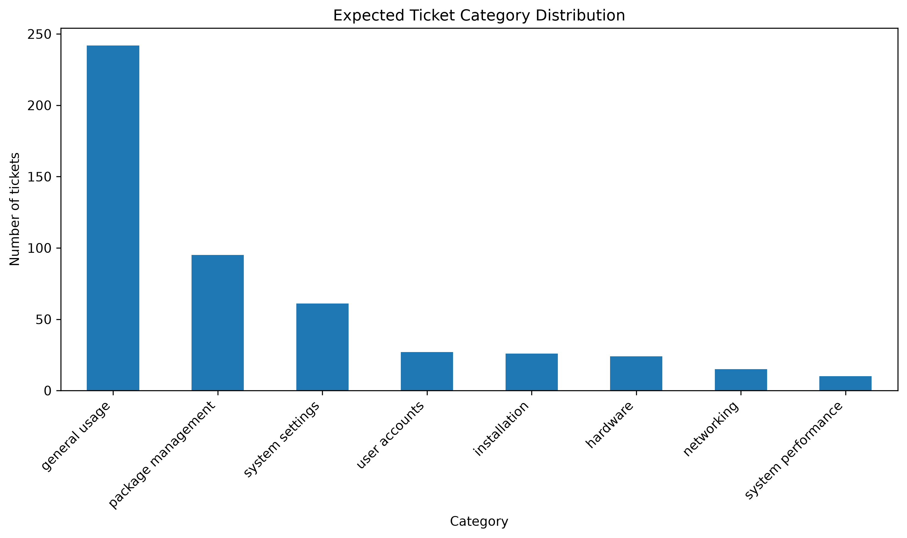
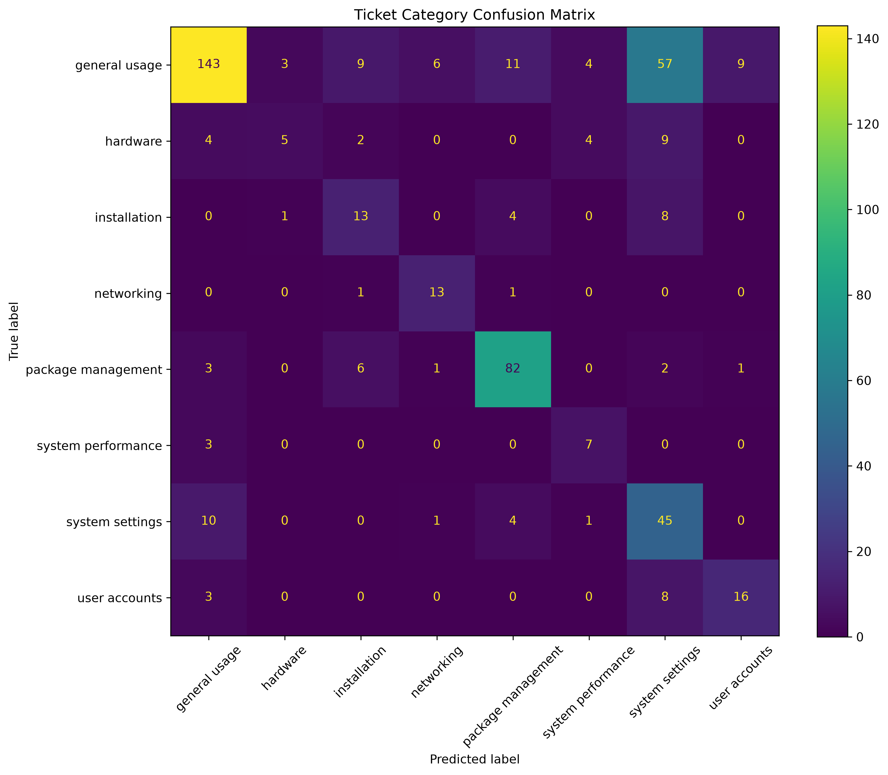

Tickets evaluated: 500

Category accuracy: 64.80%
Macro F1-score: 57.88%
Weighted F1-score: 65.85%

Resolver-team accuracy: 48.40%
Category-to-resolver consistency: 61.80%

Misclassified tickets: 176

Largest category:
general usage
242 tickets
48.40% of the dataset

Smallest category:
system performance
10 tickets
2.00% of the dataset

|#	 | column    	            | missing values| blank strings| unique values|
|---:|--------------------------|--------------:|-------------:|-------------:|
|0	 | title	                | 0             | 0            | 500          |
|1	 | description	            | 0             | 0            | 500          |
|2	 | expected category	    | 0             | 0            | 8            |
|3	 | expected priority	    | 500           | 0            | 1            |
|4	 | expected resolver_team	| 0             | 0	           | 6            |
|5	 | actual category	        | 0             | 0	           | 8            |
|6	 | actual priority	        | 0             | 0	           | 4            |
|7	 | actual resolver_team	    | 0             | 0	           | 6            |
|8	 | reason	                | 0             | 0	           | 500          |
|9	 | category same T/F	    | 0             | 0	           | 2            |
|10	 | resolver same T/F	    | 0             | 0	           | 2            |

|#  |category	           |count |percentage|
|---:|-----------------|------------:|----:|
|0	|general usage	        |242 |48.4|
|1	|package management	    |95  |19.0|
|2	|system settings	    |61  |12.2|
|3	|user accounts	        |27  |5.4|
|4	|installation	        |26  |5.2|
|5	|hardware	            |24  |4.8|
|6	|networking	            |15  |3.0|
|7	|system performance	    |10	 |2.0|

|# | metric	|value	|percentage|
|-:|-----------------:|--------:|-------:|  
|0 | Category accuracy|	0.648000|	64.80|
|1 | Macro F1-score|	0.578847|	57.88|
|2 | Weighted F1-score|	0.658541|	65.85|

|#                  |precision	|recall	|f1-score	|ticket count|
|-------------------|----------:|------:|----------:|-----------:|
|general usage	    |86.14	    |59.09	|70.10	    |242|
|hardware	        |55.56	    |20.83	|30.30	    |24|
|installation	    |41.94	    |50.00	|45.61	    |26|
|networking	        |61.90	    |86.67	|72.22	    |15|
|package management	|80.39	    |86.32	|83.25	    |95|
|system performance	|43.75	    |70.00	|53.85	    |10|
|system settings	|34.88	    |73.77	|47.37	    |61|
|user accounts	    |61.54	    |59.26	|60.38	    |27|
|accuracy	        |64.80	    |64.80	|64.80	    |1|
|macro avg	        |58.26	    |63.24	|57.88	    |500|
|weighted avg	    |72.13	    |64.80	|65.85	    |500|

|#  |expected category	|actual category	|count|
|---|------------------:|------------------:|---:|
|5	|general usage	    |system settings	|57|
|3	|general usage	    |package management	|11|
|22	|system settings	|general usage	    |10|
|6	|general usage	    |user accounts	    |9|
|10	|hardware	        |system settings	|9|
|1	|general usage	    |installation	    |9|
|13	|installation	    |system settings	|8|
|27	|user accounts	    |system settings	|8|
|17	|package management	|installation	    |6|
|2	|general usage	    |networking	        |6|
|7	|hardware       	|general usage	    |4|
|4	|general usage	    |system performance	|4|
|12	|installation	    |package management	|4|
|24	|system settings	|package management	|4|
|9	|hardware	        |system performance	|4|
|0	|general usage	    |hardware	        |3|
|26	|user accounts	    |general usage	    |3|
|16	|package management	|general usage	    |3|
|21	|system performance	|general usage	    |3|
|8	|hardware	        |installation	    |2|

|expected category	|ticket count	|correct classifications	|accuracy	|accuracy percentage|
|------------------:|--------------:|--------------------------:|----------:|------------------:|
|hardware	        |24	            |5                      	|0.208333	|20.83|
|installation	    |26	            |13                     	|0.500000	|50.00|
|general usage	    |242	        |143                        |0.590909	|59.09|
|user accounts	    |27	            |16                     	|0.592593	|59.26|
|system performance	|10	            |7                      	|0.700000	|70.00|
|system settings	|61	            |45                     	|0.737705	|73.77|
|package management	|95	            |82                     	|0.863158	|86.32|
|networking	        |15	            |13                     	|0.866667	|86.67|

|category           |precision	|recall	|f1-score	|ticket count|
|-------------------|-----------|-------|-----------|------|
|hardware	        |55.56	    |20.83	|30.30	    |24|
|installation	    |41.94	    |50.00	|45.61	    |26|
|general usage	    |86.14	    |59.09	|70.10	    |242|
|user accounts	    |61.54	    |59.26	|60.38	    |27|
|system performance	|43.75	    |70.00	|53.85	    |10|
|system settings	|34.88	    |73.77	|47.37  	|61|
|package management	|80.39	    |86.32	|83.25	    |95|
|networking	        |61.90	    |86.67	|72.22	    |15|

|#  |Measure	                |Result|
|---|---------------------------|------|
|0	|Tickets evaluated	        |500|
|1	|Category accuracy	        |64.80%|
|2	|Macro F1-score	            |57.88%|
|3	|Weighted F1-score	        |65.85%|
|4	|Resolver-team accuracy	    |48.40%|
|5	|Category/team consistency	|61.80%|
|6	|Misclassified tickets	    |176|

